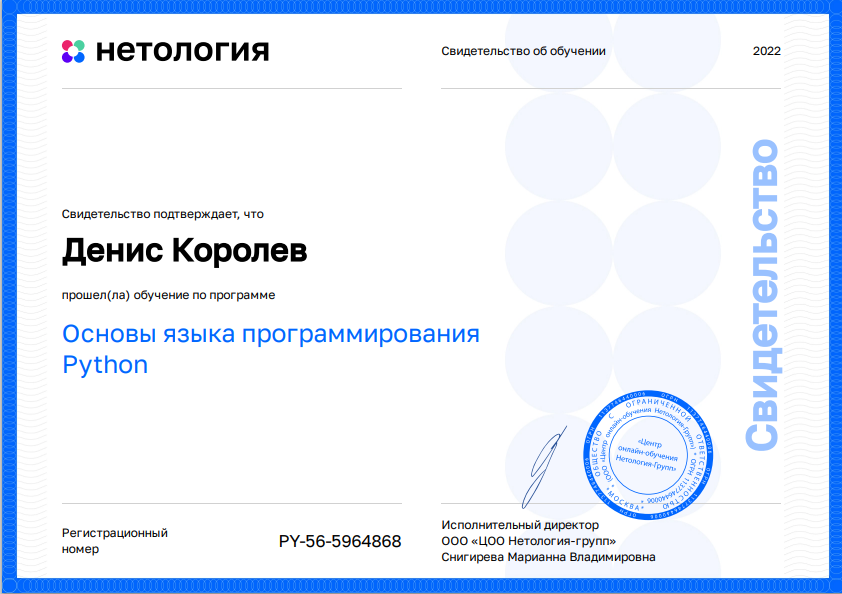
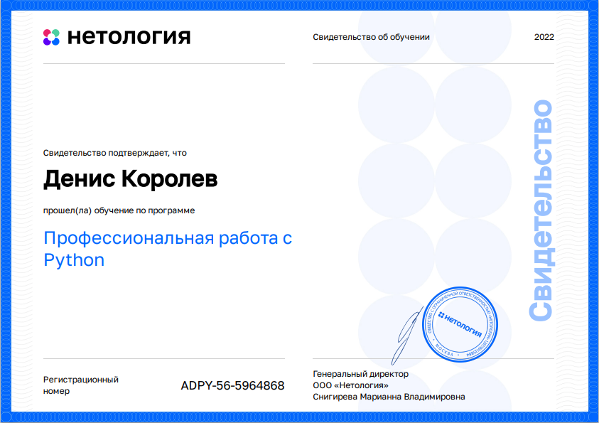
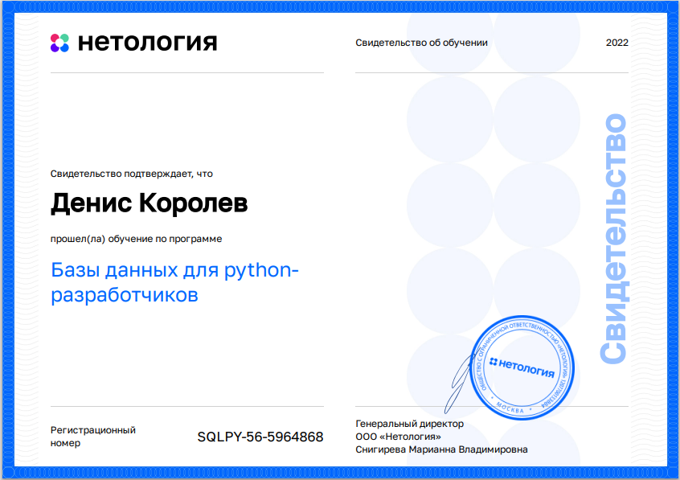
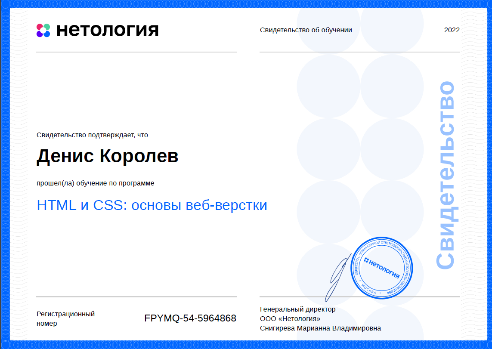
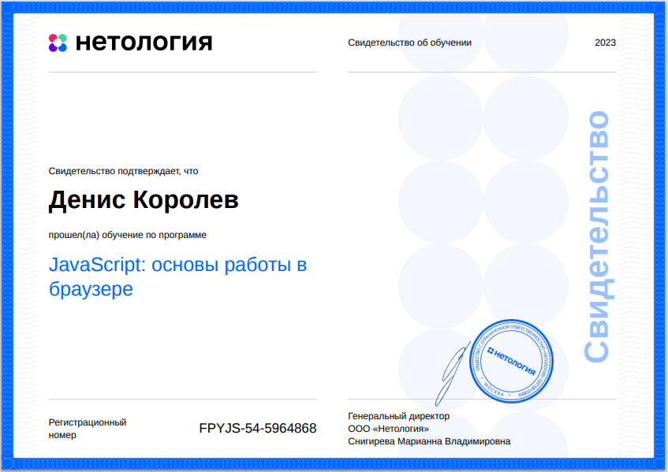
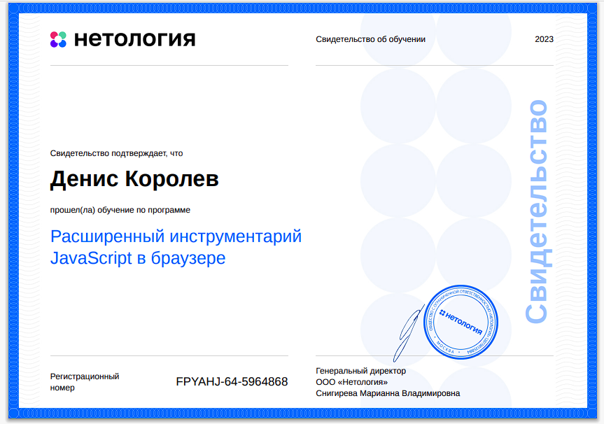
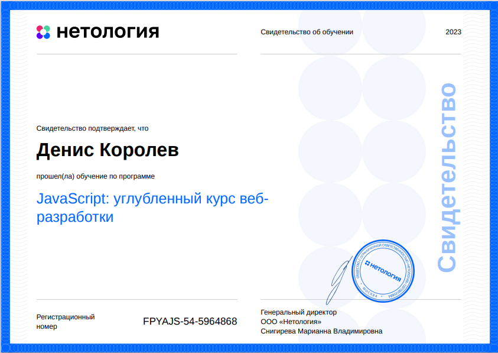
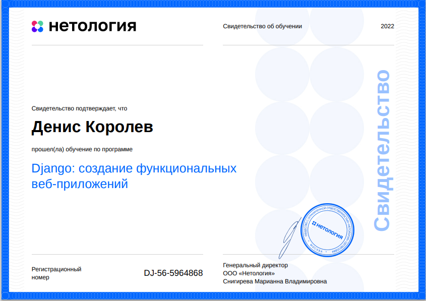

# Hi 👋🏼 I'm Denis Korolev. My name in online is Tryd0g0lik.

For me is interesting to work with you and your team a long time.

**Skills:** [TJ]S / JQ / HTML / CSS / Python / Pandas / Numpy / SQL / DaisyUI / tailwindcss / async/await / babel / Service Worker, Local Storage, WebSocket, Node, Django,  Postgresql / REST API / Git / SCSS / ООП / Json / Figma / Photoshop / English A2

**Resume:** [Resume_of_Y.Disk](https://disk.yandex.ru/i/GRqe7EKGiXs2BQ) \
[Telegram](https://t.me/Trydogolik) \
My working time is 8 - 14 hours 

**i'm using**: \

 

**Languages and Tools**: \

Здравствуйте!
Меня зовут Денис, а в сети мое имя Tryd0g0lik.💻🖱

Для меня интересно работать с вами и вашей командой длительное время.

Еще год назад работал на рынке интернет-маркетинга, но уже занимался html-версткой. 
Сейчас заинтересован работать на рынке разработков.

   

Опыт в:
- 2024 - ... React, Redux, Redis
- 2023 - ... Django, SQL, WebSocket, Kio, PostgreSQL;
- 2022 - ... English A2. SQL, PostgreSQL, Python, парсинг и чистка данных;
- 2021- ... .HTML, CSS, JS, JQ;
- 2019 - ... .Вэб-Usability;
- 2019 - 2021гг.- контекстная реклама Google;
- 2018 - 2021 .гг.- контекстная реклама Яндекс, HTML, CSS;
- 2013 - 2014гг. - SEO-аудит сайта;
- 2012 - 2020 гг.- ретушь фотографий - хобби;
- 2009 - 2014гг. - web-контент;
- 2010 - 2014гг. и 2018гг. - email-верстка;
- 2010 - 2013гг. - HTML, CSS, блочная, табличная верстка.

🔭 I’m currently working on this page. 

          

**Electronic certificates**: \

 \
 
 
 \
 
 

