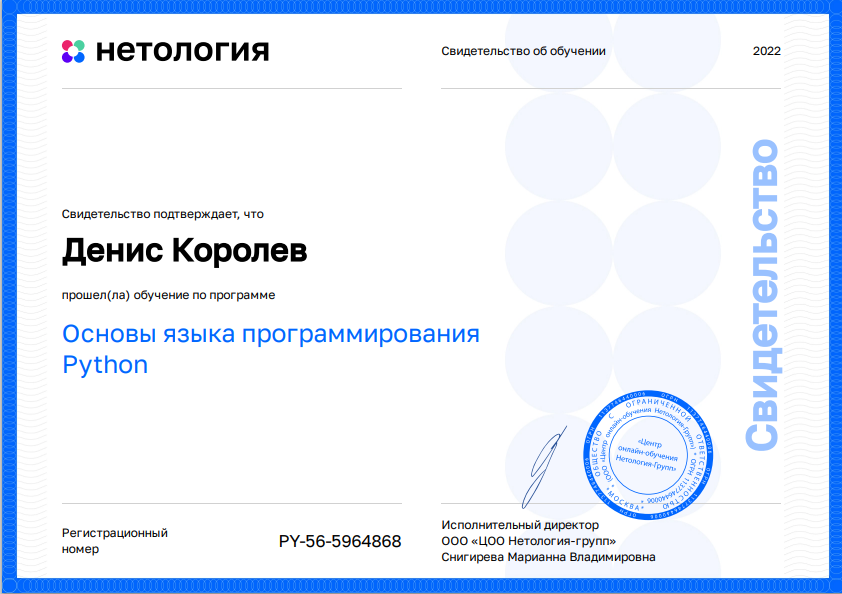
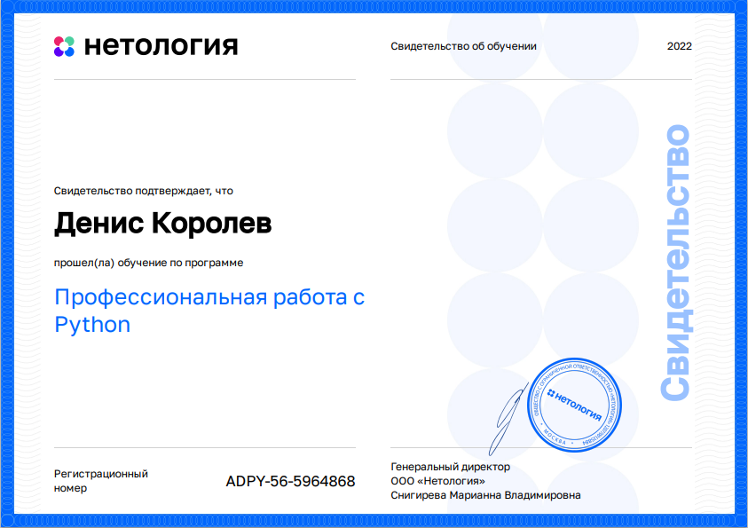
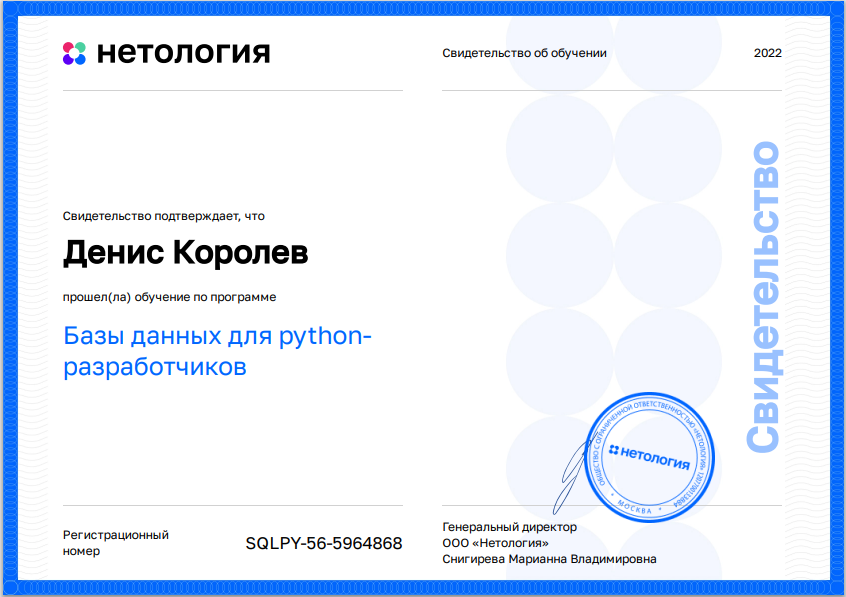
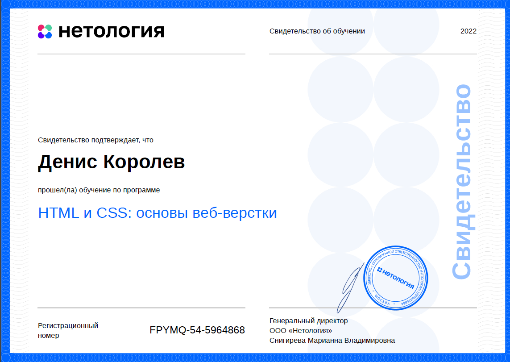
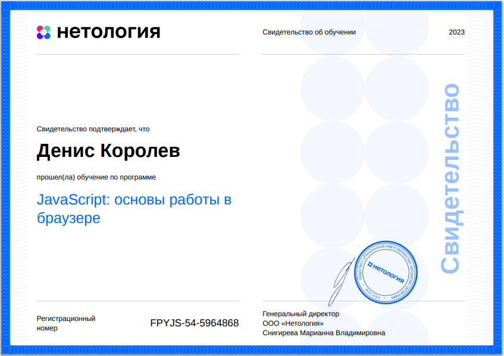
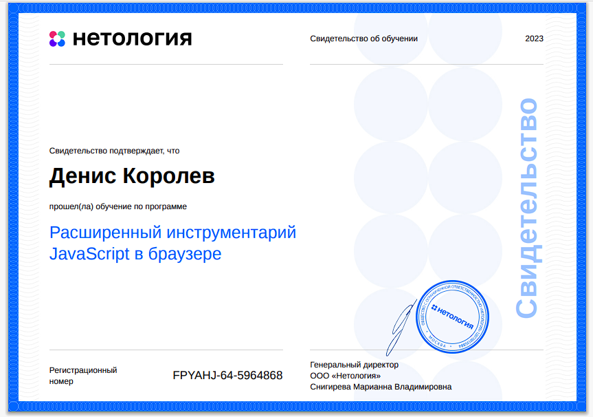
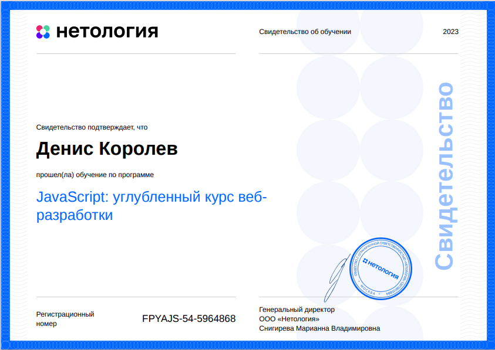
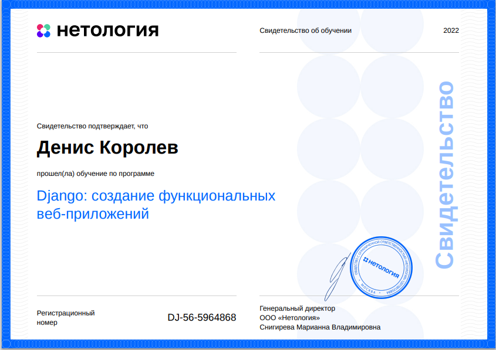

# Hi 👋🏼 I'm Denis Korolev. My name in online is Workaholic.

I'm interesting in working with you and your team a long time.

|||||
|:------|:------|:------|:------|
|1. **My a working skills:**|2. **Python 3.2/3.7/3.8/3.9/3.10/3.11**|3. **JS+**|4.|
|Languages: SCSS, HTML, JS,TS, React, Redux, Router, Toolkit, DOM, Python|tailwind, daisyui, Bootstrap|pg.Client (postgres)|Figma, Photoshop, English A2|
|OS: Windows & Ubuntu|Requests, Postman, RESTAPI, OpenAPI|WebSocket, HTTP, Fetch|PEP8, float8, ESlint, husky, pre-commit, github Actions, server|
|DB: PostgreSQL, SQL (Basic)|asyncio, asyncio.gether, |Promise, async/await, Promise.all()|Installers: pip, poetry, npm, yarn|
|WF: Django, Flask,  JQ, React, tailwind, daisyui, Bootstrap|SQLAlchemy (from Flask)|Koa/express (Node)|IDE: VSCode, PyCharm, Notepad++, Photoshop, Postman,  bash (mkdir, cd, rm, pwd, ls, nano cat)|
||Pandas, Numpy|||
|||||

## My a working skills
||||
|:---|:---|:---|
|React|Django|Hash|
|TypeScript|Signal| Linux Ubuntu (and BIOS)|
|PostgreSQL (SQL little)|SSH, FTP|Bash|
|Pytest, Playwright|Postman|Hml/scss|
|HTTP, WebSocked|Promise.all, Promise.allSettled, asyncio.all, asyncio.wait||
||||

### Django

|||
|:---|:---|
|[DRF](https://www.django-rest-framework.org/)|[django-rest-framework-jwt](https://django-rest-framework-simplejwt.readthedocs.io/en/latest/)|
|[django-rest-auth](https://www.django-rest-framework.org/api-guide/authentication/)|[pytest-django](https://pypi.org/project/pytest-django/)|
|[django-bootstrap4](https://pypi.org/project/django-bootstrap4/)|[django-cors-headers](https://pypi.org/project/django-cors-headers/)|
|[adrf](https://pypi.org/project/adrf/)|[django-webpack-loader](https://pypi.org/project/django-webpack-loader/)|
|||

I’m have experience: debug; logging; OpenAPI; DevTools.

## Resume:

|||
|:----|:----|
|Version||
|[RU](https://disk.yandex.ru/i/A9eajolzDHaxhw)|[ENG](https://disk.yandex.ru/i/A9eajolzDHaxhw)|

## Review
||
|:----|
|[Telegram](https://t.me/Trydogolik)|
|[linkedin](https://www.linkedin.com/in/денис-королев-183ba165/)|
|[HeadHunter RU](https://novosibirsk.hh.ru/resume/7dcc330fff0b1abd850039ed1f50374d736f51)|
|[HeadHunter ENG](https://novosibirsk.hh.ru/resume/1f2e02e5ff0d62671f0039ed1f4b6337425a31)|

**i'm use**: \

 

**Languages and Tools**: \

Здравствуйте!
Меня зовут Денис, а в сети мое имя Tryd0g0lik.💻🖱

Для меня интересно работать с вами и вашей командой длительное время.

Еще год назад работал на рынке интернет-маркетинга, но уже занимался html-версткой. 
Сейчас заинтересован работать на рынке разработчиков.

## Exemple (simple) 

|||
|:---|:---|
|[ads](https://github.com/Tryd0g0lik/adboard/tree/master)|[weather](https://github.com/Tryd0g0lik/weather)|

  

Опыт в:
- 2024 - ... React, Redux, Redis
- 2023 - ... Django, SQL, WebSocket, Kio, PostgreSQL;
- 2022 - ... English A2. SQL, PostgreSQL, Python, парсинг и чистка данных;
- 2021- ... .HTML, CSS, JS, JQ;
- 2019 - ... .Вэб-Usability;
- 2019 - 2021гг.- контекстная реклама Google;
- 2018 - 2021 .гг.- контекстная реклама Яндекс, HTML, CSS;
- 2013 - 2014гг. - SEO-аудит сайта;
- 2012 - 2020 гг.- ретушь фотографий - хобби;
- 2009 - 2014гг. - web-контент;
- 2010 - 2014гг. и 2018гг. - email-верстка;
- 2010 - 2013гг. - HTML, CSS, блочная, табличная верстка.

🔭 I’m currently working on this page. 

          

**Electronic certificates**: \

 \
 
 
 \
 
 

