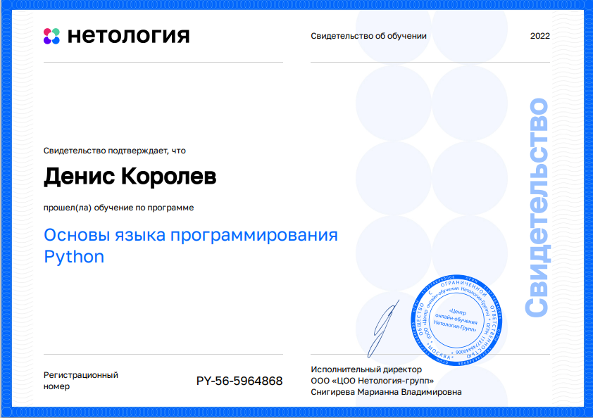
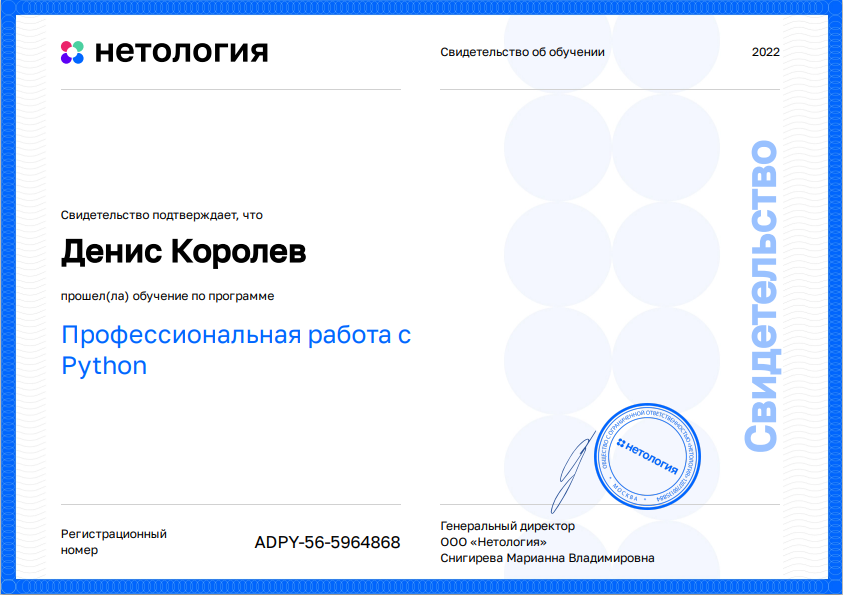
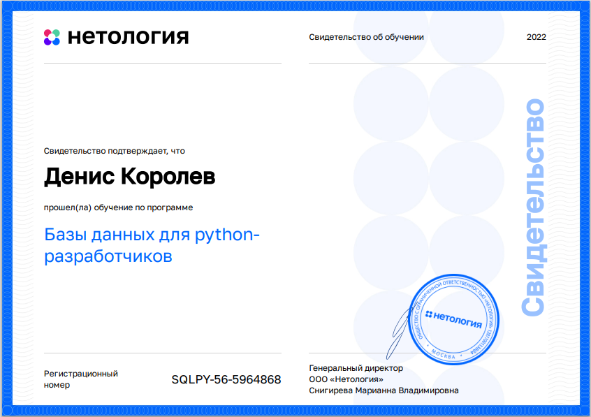
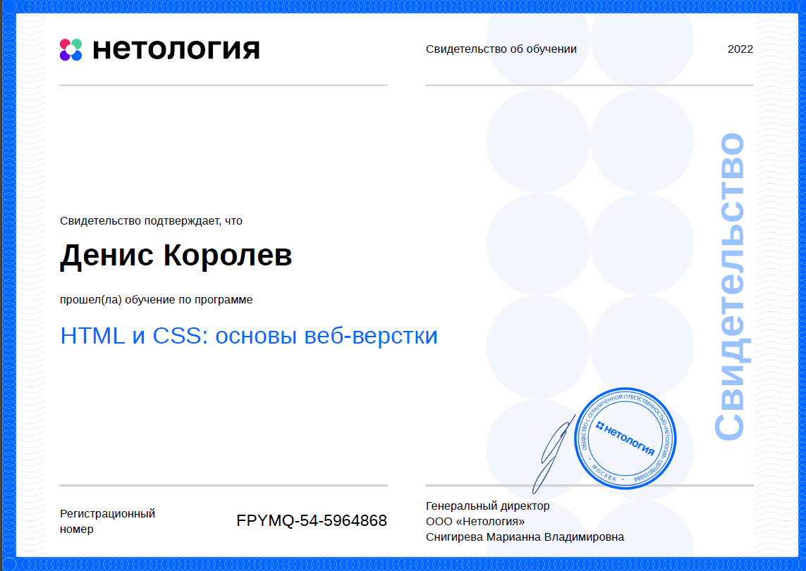
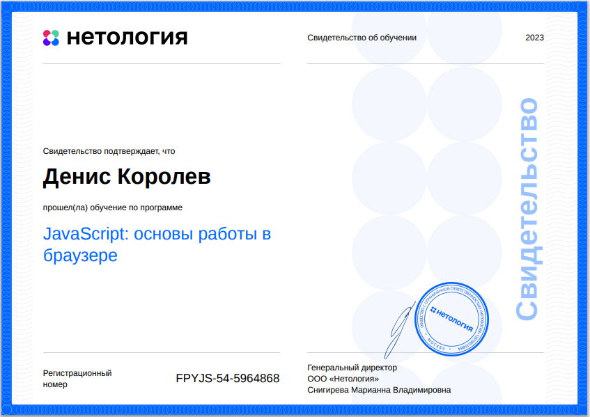
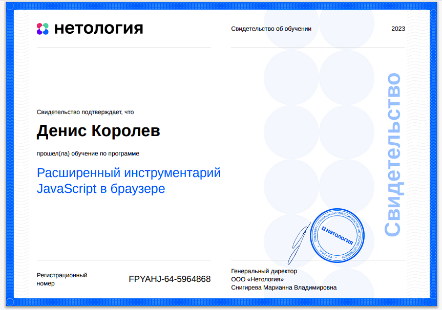
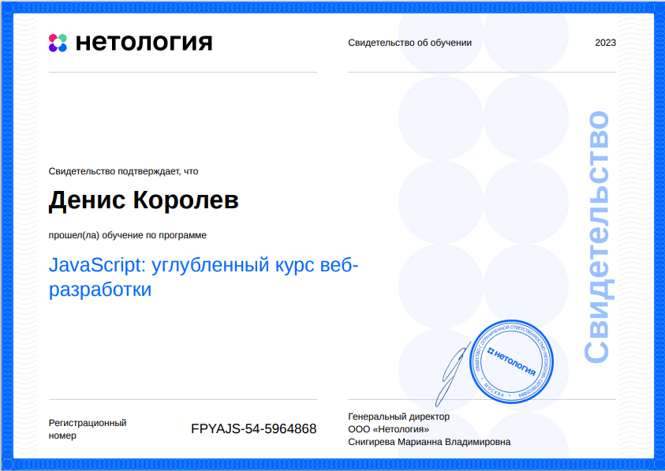
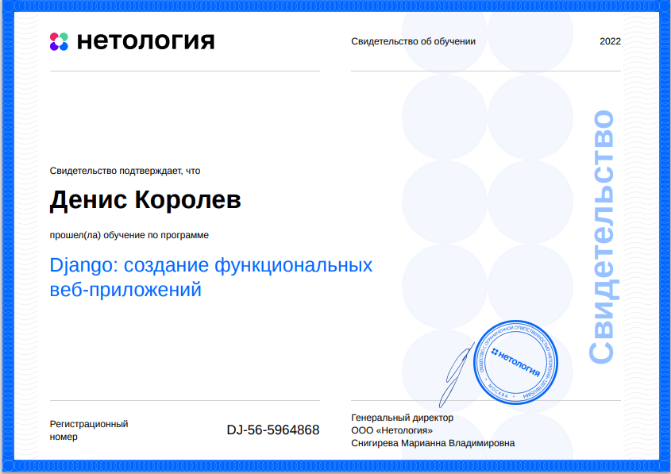

### Actively seeking work. I'm open to all opportunities.

# Hi 👋🏼 I'm Denis Korolev. My name in online is Workaholic.

*Note: First , I want say what — my a conversational English is very bad.\
Bad I can a read and write text (it’s comments of code and documentation of code) or chatting with teams. It’s all very free.
More information about me, you can see in my file. Below, You can see the links on the resume.\
I hope, your team will help me and pull up me.* 

## Resume & Portfolio:

|                                                                              |                                                                               |
|:-----------------------------------------------------------------------------|:------------------------------------------------------------------------------|
| Version of resume                                                            |                                                                               |
| [RU resume](https://disk.yandex.ru/i/A9eajolzDHaxhw)                         | [ENG resume](https://disk.yandex.ru/i/A9eajolzDHaxhw)                         |
| Version of portfolio                                                         |                                                                               |
| [Descript of portfolio RU download](https://disk.yandex.ru/i/Lor2mlNVmCKv9A) | [Descript of portfolio ENG download](https://disk.yandex.ru/i/JuC_HxSPoEal7w) |

I'm interesting in working with you and your team a long time.

|                                                                                                  |                                                                   |                                     |                                                                                               |
|:-------------------------------------------------------------------------------------------------|:------------------------------------------------------------------|:------------------------------------|:----------------------------------------------------------------------------------------------|
| 1. **My a working skills:**                                                                      | 2. **Python 3.+**                                                 | 3. **JS** React, TypScript          | 4.                                                                                            |
| Languages: SCSS, HTML, JS,TS, React, Redux, Router, Toolkit, DOM, Python                         | tailwind, daisyui, Bootstrap                                      | pg.Client (postgres)                | Figma, Photoshop                                                                              |
| OS: Windows & Ubuntu                                                                             | Requests, Postman, RESTAPI, OpenAPI                               | Fetch         | PEP8, float8, ESlint, husky, pre-commit, github Actions, server, WebSocket, SSE, HTTP                             |
| DB: Celery + Redis (The time manager), SQLite, PostgreSQL. SQL, SQLAlchemy, Alembic, SQL (Basic) | asyncio, async/await, threading,                                  | Promise, async/await | Installers: pip, poetry, npm, yarn                                                            |
| WF: Django, FastAPI,  JQ, React, tailwind, daisyui, Bootstrap                                    | aiohttp                                                           | Koa/express (Node) jun              | IDE: VSCode, PyCharm, Notepad++, Photoshop, Postman,  bash (mkdir, cd, rm, pwd, ls, nano cat) |
|                                                                                                  | Pandas (basis),                                                   |DevTools, React Developer Tools| DevOps (little) & CICD & GITHUB Action                                                        |
|                                                                                                  | Pytest (e2e, function, module), Playwright (basic test + scraper) |Jest (basis)|                                                                                               |
|                                                                                                  |                                                                   |                                     |                                                                                               |

### Django

|||
|:---|:---|
|[DRF](https://www.django-rest-framework.org/)|[django-rest-framework-jwt](https://django-rest-framework-simplejwt.readthedocs.io/en/latest/)|
|[django-rest-auth](https://www.django-rest-framework.org/api-guide/authentication/)|[pytest-django](https://pypi.org/project/pytest-django/)|
|[django-bootstrap4](https://pypi.org/project/django-bootstrap4/)|[django-cors-headers](https://pypi.org/project/django-cors-headers/)|
|[adrf](https://pypi.org/project/adrf/)|[django-webpack-loader](https://pypi.org/project/django-webpack-loader/)|
|[wagtail](https://wagtail.org/)||
|||

I’m have experience: debug; logging; OpenAPI; DevTools.

## Contacts
||                                                   |
|:----|:--------------------------------------------------|
|[Telegram](https://t.me/Trydogolik)| [kwork profile](https://kwork.ru/user/workaholik) |
|[linkedin](https://www.linkedin.com/in/денис-королев-183ba165/)|[freelance profile](https://freelance.ru/Trydogolik)|
|[HeadHunter RU](https://novosibirsk.hh.ru/resume/7dcc330fff0b1abd850039ed1f50374d736f51)||
|[HeadHunter ENG](https://novosibirsk.hh.ru/resume/1f2e02e5ff0d62671f0039ed1f4b6337425a31)||

**i'm use**: \

 

**Languages and Tools**: \

Здравствуйте!
Меня зовут Денис, а в сети мое имя Tryd0g0lik.💻🖱

Для меня интересно работать с вами и вашей командой длительное время.

Еще год назад работал на рынке интернет-маркетинга, но уже занимался html-версткой. 
Сейчас заинтересован работать на рынке разработчиков.

## Portfolio (simple) 

|||
|:---|:---|
|[krypto_market](https://github.com/Tryd0g0lik/krypto_market)||
|[Personal](https://github.com/Tryd0g0lik/personal)|[Rtuck_Driver](https://github.com/Tryd0g0lik/truck_driver)|
|[truck_driver front](https://github.com/Tryd0g0lik/truck_driver_front)||
|[ads-dashboard](https://github.com/Tryd0g0lik/adboard/tree/master)|[SMS from service page of browser](https://github.com/Tryd0g0lik/mts_sms_front/tree/master)|
|[user's files saving to the cloud and referral link for download](https://github.com/Tryd0g0lik/cloud)|[job with cinema](https://github.com/Tryd0g0lik/cinema_category)|
|[and more](https://github.com/Tryd0g0lik/flows_fronted)|[and more](https://github.com/Tryd0g0lik/flows)|
|[weather service](https://github.com/Tryd0g0lik/weather)|[and UI](https://github.com/Tryd0g0lik/weather_front)|
|||

[And more - download](https://disk.yandex.ru/i/JuC_HxSPoEal7w)

My a working experience:
- 2025 - ... SQLite, Redis, CICD, FastApi, SSL,
- 2024 - ... React, Redux, Celery, bash, Playwright, threading;
- 2023 - ... Kio, Node, jest, "tailwind & daisyui", Flask;
- 2022 - ... English A2. SQL, PostgreSQL, Python, parsing and  clean of data, Django, 
	SQL, pytest, WebSocket, PostgreSQL, API local/out
	SSH, asyncio, promise;
- 2021- ... Figma;
- 2019 - ... .Вэб-Usability;
- 2010 - ... - HTML, CSS, Photoshop, FTP, JS.
- 2019 - 2021гг.- Google ADS & metrics;
- 2018 - 2021 .гг.-  Yandex "ads" & metrics
- 2013 - 2014гг. - SEO;
- 2012 - 2020 гг.- photoshop;
- 2009 - 2014гг. - web-html/css;
- 2010 - 2014гг. и 2018гг. - email-css.

🔭 I’m currently working on this page. 

          

**Electronic certificates**: \

 \
 
 
 \
 
 

